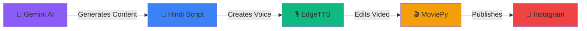

# 🎬 AutoReelBot

<div align="center">


**AI-Powered Instagram Reels Automation System**

Fully automated pipeline for generating and publishing viral motivational content with zero manual intervention.

[Quick Start](#-quick-start) • [Features](#-core-features) • [Documentation](#-documentation) • [Troubleshooting](#-troubleshooting)

</div>

---

## 📖 Overview

**AutoReelBot** is an end-to-end automation system that generates professionally edited Instagram Reels with AI-powered content, natural voice-overs, and cinematic visual effects. Perfect for content creators, motivational pages, and social media managers who want to maintain consistent posting schedules with high-quality, viral-ready content.

### 🎯 What It Does



1. **Generates** unique Hindi motivational quotes using Google Gemini AI
2. **Creates** natural-sounding voice-overs with Microsoft EdgeTTS
3. **Edits** videos with cinematic filters, Ken Burns effects, and professional transitions
4. **Uploads** directly to Instagram with optimized captions and hashtags

### 💡 Perfect For

- 🎥 Content creators automating their workflow
- 💪 Motivational page owners
- 📱 Social media managers
- 🚀 Anyone wanting consistent Instagram Reels

---

## ✨ Core Features

### 🤖 AI-Powered Content Generation

| Feature | Description |
|---------|-------------|
| **Gemini AI Integration** | Generates unique, viral-worthy Hindi motivational content |
| **Dynamic Themes** | 10+ different themes (discipline, success, warrior mindset, etc.) |
| **Smart Captions** | SEO-optimized captions with trending hashtags |
| **Zero Repetition** | Each video is completely unique |

### 🎨 Advanced Video Editing

- **Multiple Visual Filters**: Cinematic, Warm, Cool filters for professional aesthetics
- **Ken Burns Effect**: Dynamic 1.15x-1.25x zoom/pan on every image
- **Smooth Transitions**: 1-second professional transitions between scenes
- **Smart Selection**: 6-7 random images per video for variety
- **Instagram-Optimized**: Automatic 9:16 (1080x1920) formatting

### 🎙️ Natural Voice Generation

```yaml
EdgeTTS Parameters:
  Voice: hi-IN-MadhurNeural (Deep, Natural Hindi)
  Rate: +10% (natural pacing)
  Pitch: -15Hz (moderate deepening)
  Volume: +15% (clear and balanced)
  
Audio Processing:
  - Normalization
  - Compression
  - EQ optimization
  - Background music mixing (30%)
```

### 📱 Instagram Integration

- ✅ Direct upload to Instagram Reels
- ✅ Secure session-based authentication
- ✅ Automatic thumbnail generation
- ✅ Caption and hashtag optimization
- ✅ Upload verification

### 🧹 Smart Resource Management

- 🗑️ Automatic temporary file cleanup
- 💾 Storage optimization
- 🔄 Efficient memory usage
- 📦 Final video-only output

---

## 🚀 Quick Start

### Prerequisites

Before you begin, ensure you have:

- **Python 3.8+** ([Download](https://www.python.org/downloads/))
- **FFmpeg** ([Download](https://ffmpeg.org/download.html))
- **Git** ([Download](https://git-scm.com/downloads))
- **Google Gemini API Key** ([Get Free Key](https://aistudio.google.com/apikey))

### Installation

#### 1. Clone the Repository

```bash
git clone https://github.com/yourusername/AutoReelBot.git
cd AutoReelBot
```

#### 2. Create Virtual Environment

```bash
# Windows
python -m venv venv
.\venv\Scripts\activate

# Linux/Mac
python3 -m venv venv
source venv/bin/activate
```

#### 3. Install Dependencies

```bash
pip install -r requirements.txt
```

#### 4. Install FFmpeg

**Windows:**
1. Download from [ffmpeg.org](https://ffmpeg.org/download.html)
2. Extract to `C:\ffmpeg`
3. Add `C:\ffmpeg\bin` to system PATH
4. Verify: `ffmpeg -version`

**Linux:**
```bash
sudo apt update && sudo apt install ffmpeg -y
```

**macOS:**
```bash
brew install ffmpeg
```

#### 5. Setup Project Structure

```bash
# Create required directories
mkdir -p assets/transitions assets/background_music images output
```

#### 6. Configure Environment

Create a `.env` file in the project root:

```env
# Required: Google Gemini API Key
GOOGLE_API_KEY=your_gemini_api_key_here

# Optional: Instagram Credentials
INSTA_USERNAME=your_instagram_username
INSTA_PASSWORD=your_instagram_password
INSTA_SESSIONID=your_session_id_here
```

> 🔑 **Get Your Gemini API Key**: Visit [Google AI Studio](https://aistudio.google.com/apikey) and create a free API key.

#### 7. Add Media Assets

**Images** (Required - minimum 6):
- Add motivational/warrior images to `images/` folder
- Supported formats: `.jpg`, `.png`, `.jpeg`
- Recommended: High-resolution (1080px+)

**Background Music** (Optional):
- Add `.mp3` files to `assets/background_music/`
- Use copyright-free music
- Music will play at 30% volume

**Transitions** (Optional):
- Add `.mp4`/`.mov` transition videos to `assets/transitions/`
- 1-2 second duration recommended

---

## 🎯 Usage

### Basic Usage

Run the automation script:

```bash
python main.py
```

**What happens:**
1. ✅ Generates unique Hindi motivational content (Gemini AI)
2. ✅ Selects 6-7 random images
3. ✅ Applies random visual filter
4. ✅ Creates video with Ken Burns effects
5. ✅ Adds 1-second transitions
6. ✅ Generates natural Hindi voice-over
7. ✅ Mixes voice with background music
8. ✅ Uploads to Instagram automatically
9. ✅ Cleans up temporary files

### Testing Without Upload

To test video generation without uploading:

```bash
python test_video_editing.py
```

Or comment out the upload in `main.py`:

```python
# Comment this line
# upload_reel(video_file, caption)
```

### Advanced Usage

For programmatic control:

```python
from video_editor import create_viral_reel_advanced

# Custom video creation
video_path = create_viral_reel_advanced(
    hindi_text="आपका प्रेरणादायक टेक्स्ट यहाँ",
    output_name="custom_reel.mp4",
    use_voice=True,
    num_images=7,                    # Specific number of images
    filter_type="cinematic",         # cinematic/warm/cool
    use_transitions=True,            # Enable transitions
    use_background_music=True        # Enable music mix
)

print(f"Video created: {video_path}")
```

### Example Output

```
🎉 SUCCESS! ENHANCED VIRAL REEL CREATED!
============================================================
📹 File: output\viral_reel.mp4
⏱️  Duration: 20.0s
🖼️  Images: 7 (2.0s each)
🎨 Filter: cinematic
⚡ Motion: Ken Burns effect on all images
🎬 Transitions: 6
🎙️ Voice: Natural Hindi (hi-IN-MadhurNeural)
🎵 Music: background_music_01.mp3 (30% volume)
💾 File size: 20.6 MB
✨ Output: Clean (temp files deleted)
============================================================
```

---

## 📁 Project Structure

```
AutoReelBot/
│
├── 📁 assets/                    # Media assets
│   ├── 📁 transitions/           # Video transitions (.mp4, .mov)
│   └── 📁 background_music/      # Background music (.mp3)
│
├── 📁 images/                    # Source images (user-provided)
│   ├── image1.jpg
│   ├── image2.png
│   └── ...
│
├── 📁 output/                    # Generated videos
│   └── viral_reel.mp4
│
├── 📄 main.py                    # Main automation script
├── 📄 video_editor.py            # Advanced video editing module
├── 📄 login.py                   # Instagram authentication
├── 📄 test_video_editing.py     # Testing script
│
├── 📄 requirements.txt           # Python dependencies
├── 📄 .env                       # Environment variables (gitignored)
├── 📄 session.json              # Instagram session (gitignored)
│
├── 📄 README.md                  # This file
├── 📄 ARCHITECTURE.md            # System architecture guide
├── 📄 API_REFERENCE.md           # API documentation
└── 📄 TROUBLESHOOTING.md         # Detailed troubleshooting guide
```

---

## 🏗️ How It Works

### System Architecture

```
┌─────────────────────────────────────────────────────────────┐
│                      MAIN CONTROLLER                        │
│                       (main.py)                             │
└───────────┬─────────────────────────────────────────────────┘
            │
            ├─── 1. Content Generation ──────────────────────┐
            │    • Google Gemini AI                          │
            │    • Dynamic theme selection                   │
            │    • Hindi script generation                   │
            │    • Caption & hashtag creation                │
            │                                                 │
            ├─── 2. Voice Generation ────────────────────────┤
            │    • Microsoft EdgeTTS                         │
            │    • Hindi voice synthesis                     │
            │    • Audio processing & enhancement            │
            │                                                 │
            ├─── 3. Video Production ────────────────────────┤
            │    • Image selection & filtering               │
            │    • Ken Burns motion effects                  │
            │    • Transition insertion                      │
            │    • Audio mixing                              │
            │    • Video rendering                           │
            │                                                 │
            └─── 4. Publishing ──────────────────────────────┘
                 • Instagram authentication
                 • Thumbnail generation
                 • Reel upload
                 • Cleanup

┌─────────────────────────────────────────────────────────────┐
│                   VIDEO EDITOR MODULE                       │
│                  (video_editor.py)                          │
├─────────────────────────────────────────────────────────────┤
│  • apply_unified_filter()      → Visual styling            │
│  • apply_ken_burns_effect()    → Motion effects            │
│  • create_viral_reel_advanced() → Main video creation       │
│  • generate_thumbnail()        → Thumbnail extraction       │
└─────────────────────────────────────────────────────────────┘

┌─────────────────────────────────────────────────────────────┐
│                  INSTAGRAM MODULE                           │
│                    (login.py)                               │
├─────────────────────────────────────────────────────────────┤
│  • Session management                                       │
│  • Multi-method authentication                              │
│  • 2FA support                                              │
│  • Error handling & recovery                                │
└─────────────────────────────────────────────────────────────┘
```

### Detailed Workflow

1. **Content Generation** (Gemini AI)
   - Selects random motivational theme
   - Generates 15-20 second Hindi script
   - Creates SEO-optimized caption
   - Generates 12-15 trending hashtags

2. **Image Processing**
   - Randomly selects 6-7 images
   - Applies unified filter (cinematic/warm/cool)
   - Resizes to 1080x1920 (9:16)
   - Applies Ken Burns zoom effect

3. **Audio Creation**
   - Generates Hindi voice-over (EdgeTTS)
   - Processes audio (normalize, compress, EQ)
   - Selects random background music
   - Mixes voice (100%) + music (30%)

4. **Video Assembly**
   - Creates 2-second clips per image
   - Adds 1-second transitions
   - Combines all clips
   - Syncs with audio track

5. **Export & Upload**
   - Renders final video (H.264, AAC)
   - Generates thumbnail
   - Uploads to Instagram
   - Cleans temporary files

---

## 📚 Documentation

### Complete Documentation

- **[ARCHITECTURE.md](ARCHITECTURE.md)** - Detailed system architecture and design decisions
- **[API_REFERENCE.md](API_REFERENCE.md)** - Complete API documentation for all modules
- **[TROUBLESHOOTING.md](TROUBLESHOOTING.md)** - Comprehensive troubleshooting guide

### External Resources

- [Google Gemini API Documentation](https://ai.google.dev/docs)
- [EdgeTTS GitHub Repository](https://github.com/rany2/edge-tts)
- [MoviePy Documentation](https://zulko.github.io/moviepy/)
- [Instagrapi Documentation](https://github.com/adw0rd/instagrapi)

---

## 🛠️ Troubleshooting

### Quick Fixes

| Issue | Solution |
|-------|----------|
| ❌ No images found | Add at least 6 images to `images/` folder |
| ❌ Voice generation failed | Install: `pip install edge-tts pydub` |
| ❌ Instagram upload failed | Get fresh sessionid from browser cookies |
| ❌ FFmpeg not found | Install FFmpeg and add to system PATH |
| ❌ ModuleNotFoundError | Run: `pip install -r requirements.txt --upgrade` |

### Common Issues

#### Instagram Authentication

**Problem**: Upload fails with "login_required"

**Solution**:
1. Open Instagram in browser (logged in)
2. Press F12 → Application → Cookies
3. Copy `sessionid` value
4. Add to `.env`: `INSTA_SESSIONID=copied_value`

#### Voice Generation

**Problem**: EdgeTTS fails or produces robotic voice

**Solution**:
1. Ensure internet connection (EdgeTTS is online-only)
2. Update edge-tts: `pip install edge-tts --upgrade`
3. Check available voices: `edge-tts --list-voices | grep hi-IN`

#### Video Rendering

**Problem**: Video export fails or produces corrupted file

**Solution**:
1. Verify FFmpeg installation: `ffmpeg -version`
2. Check disk space (need ~100MB free)
3. Close any programs using output files
4. Run with administrator privileges

For more detailed troubleshooting, see **[TROUBLESHOOTING.md](TROUBLESHOOTING.md)**

---

## 🔒 Security & Privacy

### Best Practices

- ✅ Never commit `.env` file to version control
- ✅ Use session IDs instead of passwords when possible
- ✅ Rotate API keys periodically
- ✅ Keep `session.json` private
- ✅ Review Instagram's Terms of Service

### Rate Limiting

To avoid Instagram restrictions:
- Wait at least 30 minutes between uploads
- Don't upload more than 10 videos per day
- Vary your posting times
- Use high-quality, unique content

---

## 🤝 Contributing

Contributions are welcome! Here's how:

1. **Fork** the repository
2. **Create** a feature branch: `git checkout -b feature/AmazingFeature`
3. **Commit** changes: `git commit -m 'Add AmazingFeature'`
4. **Push** to branch: `git push origin feature/AmazingFeature`
5. **Open** a Pull Request

### Development Guidelines

- Follow PEP 8 style guide
- Add docstrings to all functions
- Update documentation for new features
- Test thoroughly before submitting PR

---

## 📝 License

This project is licensed under the MIT License - see the [LICENSE](LICENSE) file for details.

---

## 🙏 Acknowledgments

- **Google Gemini AI** - Powerful content generation
- **Microsoft EdgeTTS** - Natural voice synthesis
- **MoviePy** - Video editing capabilities
- **Instagrapi** - Instagram API access
- **FFmpeg** - Multimedia processing

---

## 📧 Support

- **Issues**: [GitHub Issues](https://github.com/yourusername/AutoReelBot/issues)
- **Discussions**: [GitHub Discussions](https://github.com/yourusername/AutoReelBot/discussions)
- **Documentation**: See [docs](#-documentation) section

---

<div align="center">

**Made with ❤️ for Content Creators**

⭐ Star this repo if you find it useful!

[⬆ Back to Top](#-autoreelbot)

</div>